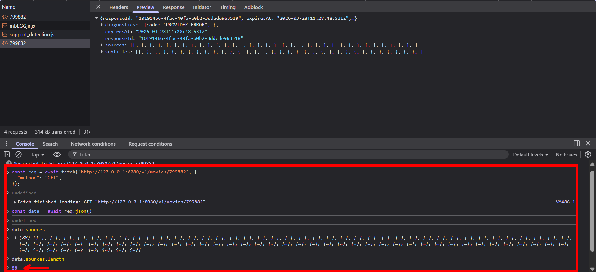

<div align="center">

# CinePro Core 🎬

</img>

### _Support CinePro's Development by starring this repo!_ ⭐

**OMSS-compliant streaming backend powering the CinePro ecosystem.**  
Built with [@omss/framework](https://www.npmjs.com/package/@omss/framework) for extensible, type-safe media scraping.

[](https://github.com/cinepro-org/core/stargazers)
[
](LICENSE)

**[📖 Documentation](https://docs.cinepro.cc)** · **[💬 Discussions](https://github.com/orgs/cinepro-org/discussions)** · **[🐛 Issues](https://github.com/cinepro-org/core/issues)**

</div>

---

CinePro Core is the central scraping and streaming engine of the CinePro ecosystem. It exposes an [OMSS-compliant](https://github.com/omss-spec/omss-spec) HTTP API for resolving movie and TV show stream sources from multiple providers, with Redis caching and full Docker support. Now even with MCP support for your AI agents! (The first streaming server worldwide to offer this feature). **Get up to 50+ unique sources for a single movie/tv show!**

<details><summary>Proof!</summary>
<p>
With failing providers still got 88 sources. If the other providers worked (which they would I not be connected to a VPN) we would have gotten more then 50 sources! Please note that this number changes very often as providers change their sites and try to block scrapers. CinePro Core is designed to be resilient to these changes with its modular provider system and regular updates, but the exact number of sources can vary over time.



</p>
</details>

> [!CAUTION]
> CinePro Core is designed for **personal and home use only.**  
> Users are responsible for ensuring compliance with applicable laws and the terms of service of streaming sources.

## Quick Start

**Prerequisites:** Node.js 20+, a [TMDB API key](https://www.themoviedb.org/settings/api)

```bash
git clone https://github.com/cinepro-org/core.git && cd core
npm install
cp .env.example .env   # add your TMDB_API_KEY
npm run dev            # http://localhost:3000
```

For Docker, production setup, and full configuration options → **[Quickstart](https://docs.cinepro.cc/quickstart)**

## Features

- 🎯 **OMSS-Compliant** – follows the Open Media Streaming Standard
- 🔌 **Modular Providers** – drop-in provider system with auto-discovery
- 🛡️ **Type-Safe** – full TypeScript with strict mode
- ⚡ **Production-Ready** – Redis caching, Docker, error handling
- 🎬 **Multi-Source** – movies and TV shows from multiple providers
- 📦 **CineHome Integration** – works with CineHome download automation

## Documentation

Full docs, API reference, configuration guide, and provider development at **[the CinePro Docs](https://docs.cinepro.cc)**.

## Contributing

PRs are welcome — especially new providers, bug fixes, and docs improvements.  
See the Documentation and the [OMSS contributing guide](https://github.com/omss-spec/omss-spec/blob/main/CONTRIBUTING.md) for details.

## Star History

<a href="https://www.star-history.com/#cinepro-org/core&type=date&legend=top-left">
 <picture>
   <source media="(prefers-color-scheme: dark)" srcset="https://api.star-history.com/svg?repos=cinepro-org/core&type=date&theme=dark&legend=top-left" />
   <source media="(prefers-color-scheme: light)" srcset="https://api.star-history.com/svg?repos=cinepro-org/core&type=date&legend=top-left" />
   
 </picture>
</a>

## License

PolyForm Noncommercial License 1.0.0 © CinePro Organization — see [LICENSE](LICENSE) for details.  
This software does not host, store, or distribute any copyrighted content.
ANY DMCA Complaints should be opened at the hosting provider and not directed at us.
[Read more here](https://docs.cinepro.cc/core/general-information/license)
